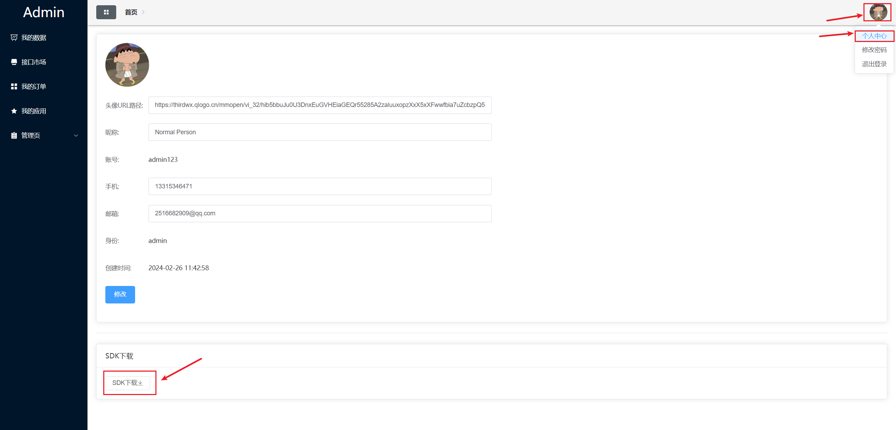
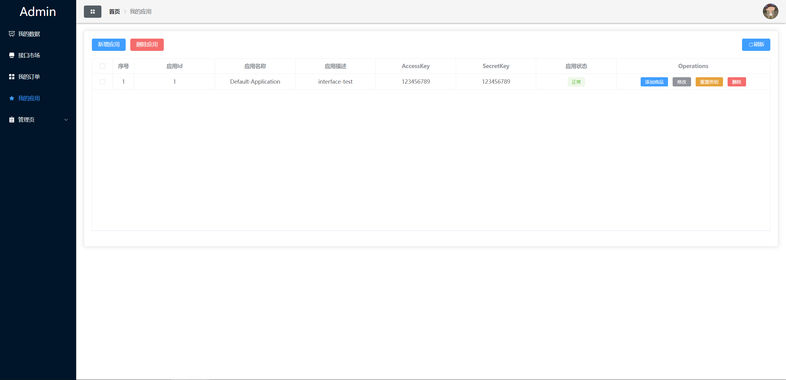

# 应用程序接口开放平台

## 接口列表
[getNameByGet](getNameByGet.md)

[getNameByPost](getNameByPost.md)

[getNameByPostBody](getNameByPostBody.md)

[随机图片](随机图片.md)

[随机生成一段文字](随机生成一段文字.md)

···

## 使用方法

### 第一步 下载官方提供的SDK

目前官方提供的SDK只支持Java版本，更多的语言版本将会不断完善。用户点击头像，选择“个人中心”，点击“SDK下载”。



### 第二步 导入依赖

将下载的SDK文件放入项目文件中，并引入依赖，确保SDK能正常使用。

```xml
<dependency>
    <groupId>com.hjh</groupId>
    <artifactId>client-sdk</artifactId>
    <version>0.0.1-SNAPSHOT</version>
</dependency>
```

### 第三步 获取Access Key和Secret Key

点击菜单栏“我的应用”，获取Access Key和Secret Key。注意：该应用中必须添加上接口对应的商品。



###  第四步 配置Access Key和Secret Key

以Spring Boot项目为例，在配置文件application.yaml中配置Access Key和Secret Key。

```yaml
client:
  access-key: 123456789
  secret-key: 123456789
```

### 第五步 通过官方文档，学会接口的使用方法


